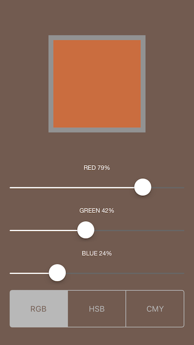
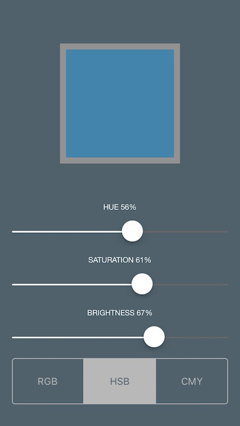
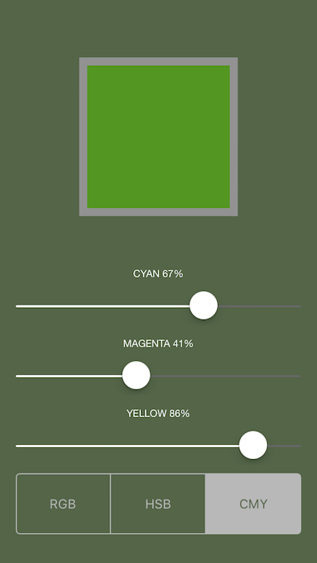

# ColorMaker
ColorMaker app for Udacity iOS nanodegree

Luke Van In 2017-01-01

## Available color modes:

1. Red+Green+Blue
2. Hue+Saturation+Brightness
3. Cyan+Magenta+Yellow

## TODO:

1. Integrate camera to use as color picker. Set aperture size, and average color of pixels.
2. Pick colors from imported images.
3. Save, delete, and share colors.
4. Calculate complementary colors.
